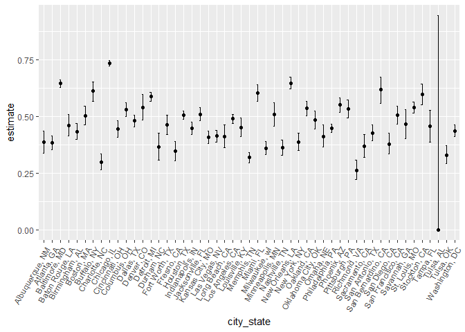
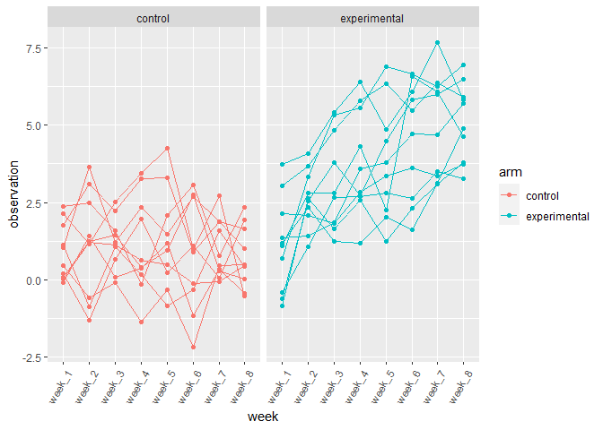
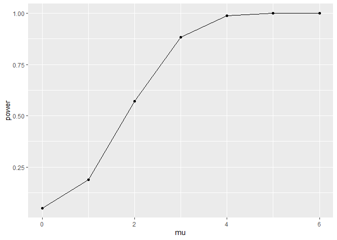
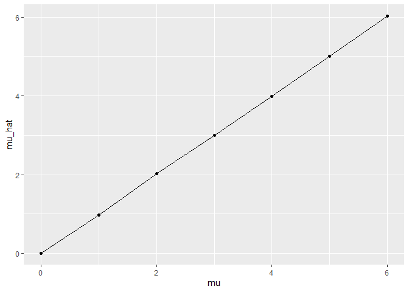
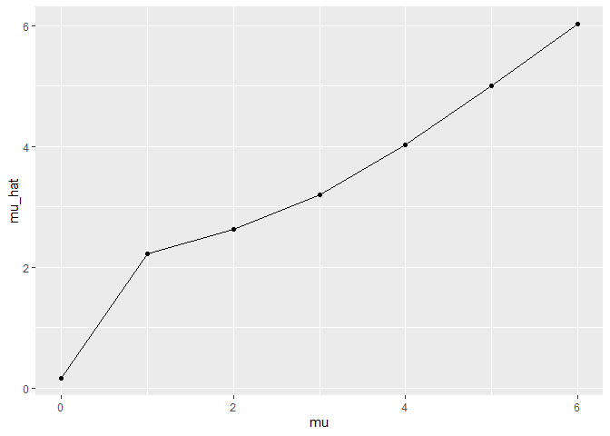

Untitled
================

``` r
library(tidyverse)
```

    ## ── Attaching core tidyverse packages ──────────────────────── tidyverse 2.0.0 ──
    ## ✔ dplyr     1.1.3     ✔ readr     2.1.4
    ## ✔ forcats   1.0.0     ✔ stringr   1.5.0
    ## ✔ ggplot2   3.4.4     ✔ tibble    3.2.1
    ## ✔ lubridate 1.9.3     ✔ tidyr     1.3.0
    ## ✔ purrr     1.0.2     
    ## ── Conflicts ────────────────────────────────────────── tidyverse_conflicts() ──
    ## ✖ dplyr::filter() masks stats::filter()
    ## ✖ dplyr::lag()    masks stats::lag()
    ## ℹ Use the conflicted package (<http://conflicted.r-lib.org/>) to force all conflicts to become errors

``` r
set.seed(35)
```

# problem 1

There are 12 variables and 52179 observations.The disposition variable
shows the result of the homicide case,such as open or closed. There are
also variables showing the position of homicide such as city, state,
lat, lon.Each observation is about the information of homicide case for
one person. The are variables showing the information of the victim such
as victim_first,victim_last,victim_age,victim_sex.

``` r
homicide = read_csv('.\\data\\homicide-data.csv')|>

  mutate(city_state = paste(city,state,sep = ', '))|>
  group_by(city_state)|>
  summarize(count = n(),
            unresolved = sum(disposition %in% c('Closed without arrest','Open/No arrest')))
```

The total number of homicide is 52179,the total number of unsolved
homicides is 26505.

``` r
baltimore = filter(homicide,city_state == 'Baltimore, MD')
proportion = prop.test(pull(baltimore,unresolved),pull(baltimore,count))|>
  broom::tidy()
```

``` r
results = homicide|>
  mutate(
    estimate_df = 
      map2(homicide$count, homicide$unresolved, \(n,q) broom::tidy(prop.test(q, n)))
  )|>
  unnest(cols = estimate_df)|>
  select(city_state,estimate,conf.low,conf.high)

results |>
  ggplot(aes(city_state,estimate))+
  geom_point(aes(x=city_state,y = estimate))+
  geom_errorbar(aes(ymin = conf.low,ymax = conf.high),width = 0.2)+
  theme(axis.text.x = element_text(angle = 60, hjust = 1))
```

<!-- -->

# problem 2

``` r
files = tibble(
  file_names = list.files('.\\data\\con_exp')
)|>
  mutate(file_data = map(file_names, \(i) read_csv(file = str_c('.\\data\\con_exp\\', i ))))|>
  unnest(file_data)|>
  mutate(file_names = str_replace(file_names,'.csv',''))|>
  pivot_longer(
    week_1:week_8,
    names_to = 'week',
    values_to = 'observation'
  )|>
  mutate(
    arm = case_when(
    grepl('exp',file_names) ~ 'experimental',
    grepl('con',file_names) ~ 'control'
  ))|>
  rename(subject_id = file_names)|>
  select(subject_id,arm,everything())

files|>
  group_by(subject_id)|>
  ggplot(aes(x = week,y = observation,group = subject_id,color = arm)) +
  geom_point()+geom_line()+
  facet_grid(~arm)+
  theme(axis.text.x = element_text(angle = 60, hjust = 1))
```

<!-- -->

From the plot, the observation values for experiment group is in a
increasing trend through week 1 to week 8,but the trend for control
group is relatively constant.

# problem 3

``` r
sim_t_test = function(mu,n=30,sigma = 5){
  
  sim_data = tibble(
    x = rnorm(n,mu,sigma)
  )
  
  t.test(pull(sim_data,x),alternative = 'two.sided',mu = 0, conf.level = 0.05)|>
  broom::tidy()|>
  select(estimate,p.value)|>
  janitor::clean_names()

}

sim_mu_0_df = 
    expand_grid(
    mu = 0,
    iter = 1:5000
  )|>
  mutate(
     estimate_df = map(mu,sim_t_test)
  )|>
  unnest(estimate_df)

sim_results_df = 
  expand_grid(
    mu = 1:6,
    iter = 1:5000
  )|>
  mutate(
    estimate_df = map(mu,sim_t_test)
  )|>
  unnest(estimate_df)

sim_results_df = bind_rows(sim_results_df,sim_mu_0_df)


sim_results_df|>
  group_by(mu)|>
  summarize(power = sum(p_value<0.05)/5000)|>
  ggplot(aes(x=mu,y= power))+
  geom_point()+geom_line()
```

<!-- -->

According to the plot, the power of t_test increase, as the true mean
increase. Since the null hypothesis is fixed, the increase of true mean
causes the increase of effect size.Thus, we can conclude that as the
effect size increases, the power will also increase.

``` r
sim_results_df|>
  group_by(mu)|>
  summarize(estimate_ave = mean(estimate))|>
  ggplot(aes(x=mu,y=estimate_ave))+
  geom_point()+geom_line()
```

<!-- -->

``` r
sim_results_df|>
  filter(p_value < 0.05)|>
  group_by(mu)|>
  summarize(estimate_ave = mean(estimate))|>
  ggplot(aes(x=mu,y=estimate_ave))+
  geom_point()+geom_line()
```

<!-- -->

according to the plot, In general,the sample average of μ hat across
tests for which the null is rejected approximately equal to the true
value of μ for larger mu value and 0 mu value,and it is less approximate
for small value such as 1 and 2. It is because when true mean is small,
the effect size is small. Then the power is less. Thus relatively large
mu hat will be out of the confidence interval. For larger mu, the effect
size and power will be larger, then there are more samples with rejected
null. The higher the proportion of these samples in the whole sample,
the more approximate of these mu hat to the true mean. For mu value 0
,mu hat is approximate to the true mean because the null hypothesis of
value of mean is equal to true mean,then the samples with rejected null
are distributed symmetrically.
